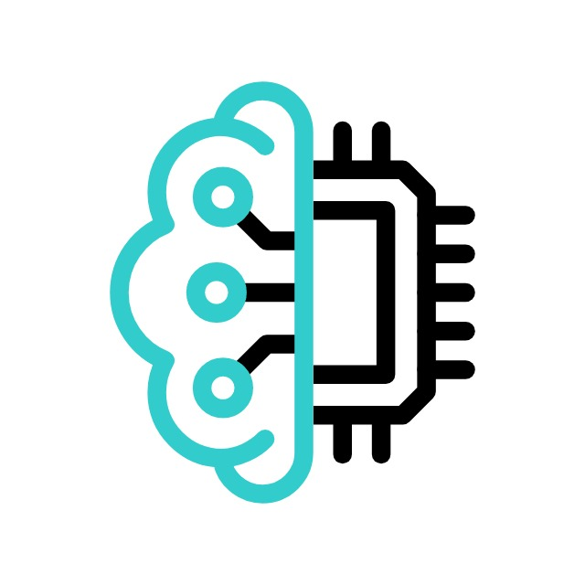

  

# CareerQuest  
___

**CareerQuest** is a web-based quiz or aptitude platform designed to help users practice and assess their skills in various areas like logical reasoning, verbal ability, coding, and more.

---

  
  <strong>Live Site:</strong> <a href="https://careerquest14.netlify.app">https://careerquest14.netlify.app</a>

---

##  Features

-  Aptitude-style questions **(analogies, logical reasoning, etc.)**
-  Interview questions for various roles like **C++ Developer, Java Developer, Python Developer, Flutter Developer, Web Developer**
-  Easy-to-use interface
-  Soft skills and common HR interview questions
-  **YouTube links** for better understanding of solving questions
-  **PDFs** included with additional questions
-  User login and registration system
-  Multiple choice quizzes added
-  Experience sharing section for interview experiences

---
## Unique Features

- **Gemini:**  Gemini serves as a smart assistant and used for a wide range of tasks like **answering questions, generating code, creating content, and explaining images or documents.** It helps students learn, developers code, job seekers prepare for interviews.

---

##  Future Improvements

- 🎯 User progress tracking
- 🔏 Backend integration for dynamic content like login
- ⁉️ Add more interview questions
- 🕵️ Mentorship and guidance section
- 🤖 AI tools integration
- 🔔 Daily challenge system with notifications

---

 

